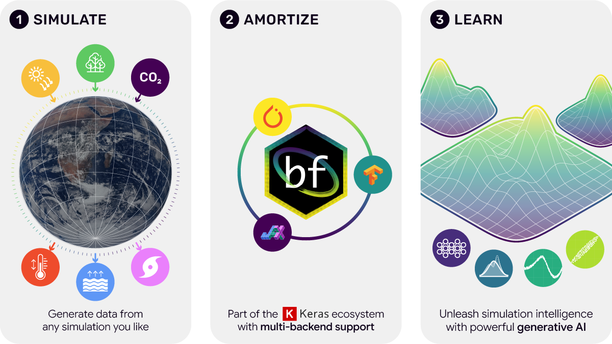

# BayesFlow


[](https://doi.org/10.21105/joss.05702)


BayesFlow is a Python library for efficient Bayesian inference with deep learning.
It provides users with:

- A user-friendly API for [amortized Bayesian workflows](https://arxiv.org/abs/2602.07098)
- A rich collection of generative models, [from diffusion to consistency models](https://bayesflow-org.github.io/diffusion-experiments/)
- Multi-backend support via [Keras3](https://keras.io/keras_3/): You can use [PyTorch](https://github.com/pytorch/pytorch), [TensorFlow](https://github.com/tensorflow/tensorflow), or [JAX](https://github.com/google/jax)

## Conceptual Overview

<div align="center">
<picture>
  <source media="(prefers-color-scheme: dark)" srcset="./img/bf_landing_dark.png">
  <source media="(prefers-color-scheme: light)" srcset="./img/bf_landing_light.png">
  
</picture>
</div>

With BayesFlow, you can easily train neural networks for tasks like parameter estimation, model comparison, and validation. It works for both complex simulators that cannot be expressed as parametric models (i.e., simulation-based inference) as well as traditional statistical models. BayesFlow provides a streamlined workflow layer for inference, especially in situations where conventional methods are unavailable or inefficient.

## Install

We currently support Python 3.11 to 3.13. You can install the latest stable version from PyPI using:

```bash
pip install "bayesflow>=2.0"
```

If you want the latest features, you can install from source:

```bash
pip install git+https://github.com/bayesflow-org/bayesflow.git@dev
```

If you encounter problems with this or require more control, please refer to the instructions to install from source below.

### Backend

To use BayesFlow, you will also need to install one of the following machine learning backends.
Note that BayesFlow **will not run** without a backend.

- [Install JAX](https://jax.readthedocs.io/en/latest/installation.html)
- [Install PyTorch](https://pytorch.org/get-started/locally/)
- [Install TensorFlow](https://www.tensorflow.org/install)

If you don't know which backend to use, we recommend JAX as it is currently the fastest backend.

As of version ``2.0.7``, the backend will be set automatically. If you have multiple backends, you can manually [set the backend environment variable as described by keras](https://keras.io/getting_started/#configuring-your-backend).
For example, inside your Python script write:

```python
import os
os.environ["KERAS_BACKEND"] = "jax"
import bayesflow
```

If you use conda, you can alternatively set this individually for each environment in your terminal. For example:

```bash
conda env config vars set KERAS_BACKEND=jax
```

Or just plainly set the environment variable in your shell:

```bash
export KERAS_BACKEND=jax
```

## Getting Started

Using the high-level interface is easy, as demonstrated by the minimal working example below:

```python
import bayesflow as bf

workflow = bf.BasicWorkflow(
    inference_network=bf.networks.FlowMatching(),
    inference_variables=["parameters"],
    inference_conditions=["observables"],
    simulator=bf.simulators.SIR()
)

history = workflow.fit_online(epochs=20, batch_size=32, num_batches_per_epoch=200)

diagnostics = workflow.plot_default_diagnostics(test_data=300)
```

For an in-depth exposition, check out our expanding list of resources below.

### Books

Many examples from *Bayesian Cognitive Modeling: A Practical Course* by Lee & Wagenmakers (2013) in [BayesFlow](https://kucharssim.github.io/bayesflow-cognitive-modeling-book/).

### Videos

A few video tutorial videos are available as part of the [Learning Bayesian Statistics](https://learnbayesstats.com/) podcast:

1. Marvin Schmitt on [Amortized Bayesian Inference with Neural Networks](https://www.youtube.com/watch?v=_lotzkvy6mY)
2. Jonas Arruda on [Diffusion Models for Simulation-Based Inference](https://www.youtube.com/watch?v=ZlcEkHXgF5k)

### Tutorial notebooks

1. [Diffusion starter](examples/Diffusion_Models.ipynb) - A small tutorial on the power of diffusion models for SBI.
2. [Linear regression](examples/Linear_Regression_Starter.ipynb) - Fit your first Bayesian regression with varying sample size.
3. [Image data](examples/Spatial_Data_and_Parameters.ipynb) - Learn parameters from or generate image data.
4. [Bayes estimators](examples/Lotka_Volterra_Point_Estimation.ipynb) - From simple point estimates to fully Bayesian inference.
5. [Model comparison](examples/One_Sample_TTest.ipynb) - Learn Bayes factors using probabilistic classification.
6. [From ABC to BayesFlow](examples/From_ABC_to_BayesFlow.ipynb) - Upgrade from sequential to amortized inference.
7. [SIR](examples/SIR_Posterior_Estimation.ipynb) - Model infectuous diseases through an end-to-end Bayesian workflow.
8. [Bayesian experimental design](examples/Bayesian_Experimental_Design.ipynb) - Perform adaptive sequential experiments.
9. [Estimating likelihoods](examples/Likelihood_Estimation.ipynb) - Learn synthetic likelihood functions.
10. [Multimodal data](examples/Multimodal_Data.ipynb) - Fuse different data types for more informative inference.
11. [Ensembles](examples/Ensembles.ipynb) - Train different networks at the same time and combine inferences.
12. [Ratio estimation](examples/Ratio_Estimation.ipynb) - Learn neural ratios for downstream MCMC sampling.

### Tutorial papers

1. Arruda, J., Bracher, N., Köthe, U., Hasenauer, J., & Radev, S. T. (2025). Diffusion Models in Simulation-Based Inference: A Tutorial Review. *arXiv preprint arXiv:2512.20685*. [Project page](https://bayesflow-org.github.io/diffusion-experiments/). [Paper](https://arxiv.org/abs/2512.20685)

More tutorials are always welcome! Please consider making a pull request if you have a cool application that you want to contribute.

## Contributing

If you want to contribute to BayesFlow, we recommend installing it from source, see [CONTRIBUTING.md](CONTRIBUTING.md) for more details.

## Reporting Issues

If you encounter any issues, please don't hesitate to open an issue here on [Github](https://github.com/bayesflow-org/bayesflow/issues) or ask questions on our [Discourse Forums](https://discuss.bayesflow.org/).

## Documentation \& Help

Documentation is available at https://bayesflow.org. Please use the [BayesFlow Forums](https://discuss.bayesflow.org/) for any BayesFlow-related questions and discussions, and [GitHub Issues](https://github.com/bayesflow-org/bayesflow/issues) for bug reports and feature requests.

## Citing BayesFlow

If you are using the new multi-backend version of BayesFlow, we recommend citing our new [software paper](https://arxiv.org/abs/2602.07098) (Kühmichel et al., 2026). For uses of the [legacy version](https://joss.theoj.org/papers/10.21105/joss.05702), you can still reference Radev et al., (2023).

**BibTeX:**

```
@article{kuhmichel2026bayesflow,
  title={{BayesFlow} 2: Multi-backend amortized {B}ayesian inference in Python},
  author={Kühmichel, Lars and Huang, Jerry M and Pratz, Valentin and Arruda, Jonas and Olischläger, Hans and Habermann, Daniel and Kucharsky, Simon and Elsemüller, Lasse and Mishra, Aayush and Bracher, Niels and Jedhoff, Svenja and Schmitt, Marvin and Bürkner, Paul-Christian and Radev, Stefan T},
  journal={arXiv preprint arXiv:2602.07098},
  year={2026}
}

@article{bayesflow_2023_software,
  title = {{BayesFlow}: Amortized {B}ayesian workflows with neural networks},
  author = {Radev, Stefan T and Schmitt, Marvin and Schumacher, Lukas and Elsemüller, Lasse and Pratz, Valentin and Schälte, Yannik and Köthe, Ullrich and Bürkner, Paul-Christian},
  journal = {Journal of Open Source Software},
  volume = {8},
  number = {89},
  pages = {5702},
  year = {2023}
}
```

## FAQ

-------------

**Question:**
I am starting with Bayesflow, which backend should I use?

**Answer:**
We recommend JAX as it is currently the fastest backend.

-------------

**Question:**
I am getting `ModuleNotFoundError: No module named 'tensorflow'` when I try to import BayesFlow.

**Answer:**
One of these applies:

- You want to use tensorflow as your backend, but you have not installed it.
See [here](https://www.tensorflow.org/install).

- You want to use a backend other than tensorflow, but have not set the environment variable correctly.
See [here](https://keras.io/getting_started/#configuring-your-backend).

- You have set the environment variable, but it is not being picked up by Python.
This can happen silently in some development environments (e.g., VSCode or PyCharm).
Try setting the backend as shown [here](https://keras.io/getting_started/#configuring-your-backend)
in your Python script via `os.environ`.

-------------

**Question:**
What is the difference between Bayesflow 2 and previous versions?

**Answer:**
BayesFlow 2.0+ is a complete rewrite of the library. It shares the same overall goals with previous versions, but has much better modularity and extensibility. What is more, the new BayesFlow has multi-backend support via Keras3, while the old version was based on TensorFlow.

-------------

## Awesome Amortized Inference

If you are interested in a curated list of resources, including reviews, software, papers, and other resources related to amortized inference, feel free to explore our [community-driven list](https://github.com/bayesflow-org/awesome-amortized-inference). If you'd like a paper (by yourself or someone else) featured, please add it to the list with a pull request, an issue, or a message to the maintainers.

## Acknowledgments

This project is currently managed by researchers from Rensselaer Polytechnic Institute, TU Dortmund University, and Heidelberg University. It is partially funded by the National Science Foundation (NSF) Award Number 2448380 and the Deutsche Forschungsgemeinschaft (DFG, German Research Foundation) Projects 528702768 and 508399956 as well as DFG Collaborative Research Center 391.

BayesFlow is a [NumFOCUS Affiliated Project](https://numfocus.org/sponsored-projects/affiliated-projects).
